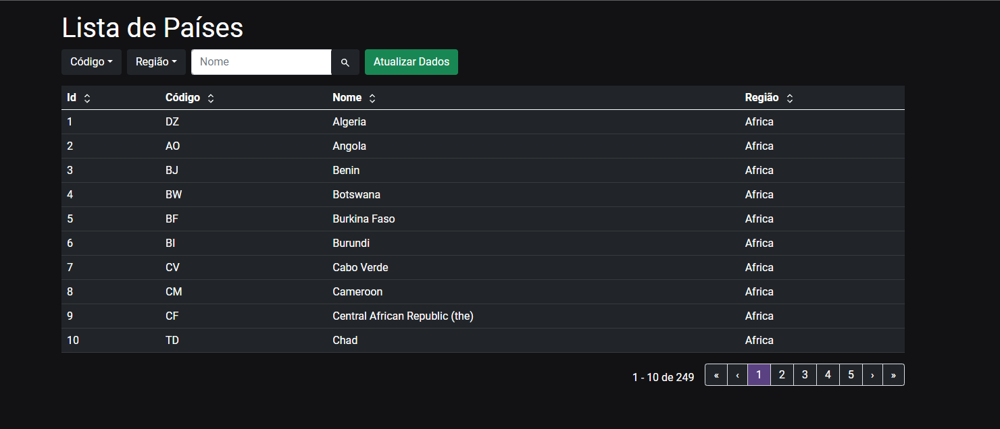

<h1 align="center">
     List Countries Project

</h1>

<h3 align="center">
    Listagem de Países
</h3>

<p align="center">
  

  
  
  <a href="https://github.com/MiguelMarcola/List-Countries-Project/commits/main">
    
  </a>
    
   
  
  
  
 
</p>

<h4 align="center">
	🚧   Concluído 🚀 🚧
</h4>

## 💻 Sobre o projeto

List Countries Project - é uma aplicação desenvolvida em React.js com Vite e Typescript que consome uma api Nodejs construida com Nestjs. Trata-se de uma página que lista os países da api, realiza uma listagem páginada de 10 em 10 e possui ordenação por qualquer campo da tabela e filtros por Código, Região e Nome. O usuário pode apertar o botão "atualizar" para chamar a api para consultar se existem novos Países para salvar na base, essa ação retorna uma mensagem de acordo com o resultado dessa requisição, a Api também é acionada para popular os filtros de dropdown.

---

## ⚙️ Funcionalidades

- [x] Consulta paginada de Países.
- [x] End-point de consulta com paginação de 10 em 10 a todos os países que estão no nosso banco de dados.
- [x] End-point de consulta com filtros por Código, Região e Nome.
- [x] End-point de consulta com ordenação por ID, Código, Região e Nome e direção crescente e decrescente.
- [x] End-point para popular os filtros consumindo os valores únicos no banco de dados.
- [x] End-point que faz a consulta na API externa e atualiza nosso banco de dados.
- [x] Tela com a exibição dos Países consultando de forma paginada ao back-end da aplicação e armazenando as páginas ja carregadas em cashe.
- [x] Inputs para filtro por Código, Região e Nome.
- [x] Tabela com botões de ordenação no header podendo ser ordenada por qualquer campo de maneira crescente e decrescente.
- [x] Botão de atualizar que acessará o end-point que faz a consulta para verificar se é possível atualizar nosso banco de dados.
- [x] Cobertura de Testes unitários de 100% no backend.
---

## 🎨 Layout

<p align="center">

  

</p>

---

## 🚀 Como executar o projeto

### Pré-requisitos

Antes de começar, você vai precisar ter instalado em sua máquina as seguintes ferramentas:
[Git](https://git-scm.com), [Node](https://nodejs.org/), [Docker Desktop](https://docs.docker.com/desktop/). 
Além disto é bom ter um editor para trabalhar com o código como o [VSCode](https://code.visualstudio.com/).

#### 🎲 Clonando o repositório e instalando as dependências

```bash

# Clone este repositório
$ git clone https://github.com/MiguelMarcola/List-Countries-Project.git

# Acesse a pasta do projeto web no terminal/cmd
$ cd List-Countries-Project/web

# Instale as dependências web
$ npm install

# Acesse a pasta do projeto server no terminal/cmd
$ cd ../server

# Instale as dependências web
$ npm install

```

Para o funcionamento de todas as funcionalidades do App será necessário criar um arquivo ".env" na raiz da pasta server projeto (List-Countries-Project/server) contendo as variáveis de ambiente do banco de dados e da documentação.

```
PROJECT_NAME=Project ARB
PROJECT_DESCRIPTION=This project is the backend to ARB Project
DOCUMENTATION_VERSION=1.0.0
DOCUMENTATION_ENDPOINT=docs
NODE_ENV=local
APP_PORT=3001
DATABASE_HOST=localhost
DATABASE_PORT=5432
DATABASE_NAME=countries
DATABASE_USERNAME=root
DATABASE_PASSWORD=s3cr3t

```

Estas são as mesmas configuração presentes no docker-compose.yml

#### 🎲 Rodando Back-end

```bash

# Acesse a pasta do projeto server no terminal/cmd
$ cd List-Countries-Project/server

# Com o docker instalado rode o seguinte comando para criar o nosso banco de dados
$ docker-compose up -d

# Execute a aplicação em modo de desenvolvimento
$ npm run start

# O servidor inciará na porta:3001 - acesse http://localhost:3001/docs e terá acesso a documentação da api

```

#### 🎲 Rodando Front-end

```bash

# Acesse a pasta do projeto server no terminal/cmd
$ cd List-Countries-Project/web

# Execute a aplicação em modo de desenvolvimento
$ npm run dev

# O servidor inciará na porta:5173 - acesse http://localhost:5173/

```

As seguintes ferramentas foram usadas na construção do projeto:

#### **Website**  ([Reactjs](https://reactjs.org/)  +  [TypeScript](https://www.typescriptlang.org/) + [Nodejs](https://nodejs.org/en/) + [Nestjs](https://nestjs.com/))

-   ReactJs
-   Vite
-   Bootstrap
-   Reactstrap
-   SASS
-   React query
-   Axios
-   Toast
-   NodeJs
-   Typescript
-   Typeorm
-   Swagger
-   Jest

> Veja o arquivo Back-end  [package.json](https://github.com/MiguelMarcola/List-Countries-Project/blob/main/server/package.json)
> Veja o arquivo Front-end  [package.json](https://github.com/MiguelMarcola/List-Countries-Project/blob/main/web/package.json)

## 🦸 Autor


 <br />
 <sub><b>Miguel Marçola</b></sub></a> 🚀
 <br />

[](https://www.linkedin.com/in/miguel-mar%C3%A7ola-28535a151/) 
[](miguelmarcola@gmail.com)

---

## 📝 Licença

Este projeto está sob a licença [MIT](./LICENSE).

Feito com muita dedicação por Miguel Marçola 👋🏽 [Entre em contato!](https://www.linkedin.com/in/miguel-mar%C3%A7ola-28535a151/)

---

